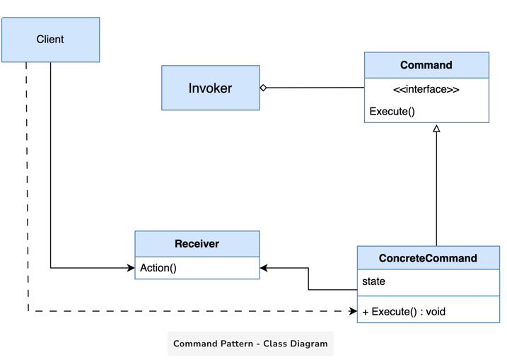

这是一个我记了10遍都没记住的破图片，实在跟这些破线条没啥缘分，
可能它们就长了一副生人勿近的样子

It transforms a request into an independent object with all the request's details. This separation enables more versatile operations such as queuing, logging, undoing actions, and delaying execution.